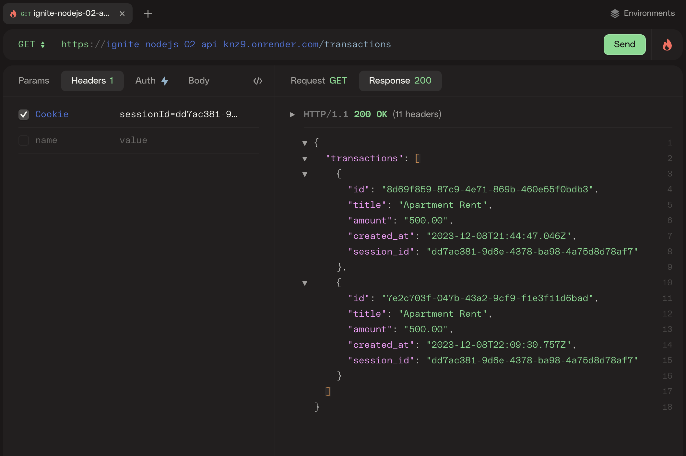

<h1 align="center">Api Rest Ignite Nodejs 02</h1>

<div align="center">
 This project serves as the fundamental structure for an API REST application utilizing the Fastify framework.
</div>

## Overview 📌

This project is a demonstration of a basic RESTful API built using Fastify, a Node.js micro framework. It features a single route dedicated to transactions. Currently, the application supports functionalities such as creating transactions, listing all transactions, and retrieving a specific transaction. These operations are based on the user session information stored in the application's cookies.

-[Api URL](https://ignite-nodejs-02-api-knz9.onrender.com)



## Technologies 🧑‍💻

- [NodeJs](https://nodejs.org/en)
- [Fastify](https://fastify.dev/)
- [Typescript](https://www.typescriptlang.org/)
- [Knex](https://knexjs.org/)
- [Zod](https://zod.dev/)
- [tsup](https://tsup.egoist.dev/)

## How To Use 👷

<!-- Example: -->

To clone and run this application, you'll need [Git](https://git-scm.com) and [Node.js](https://nodejs.org/en/download/) (which comes with [npm](http://npmjs.com)) installed on your computer. From your command line:

```bash
# Clone this repository
$ git clone git@github.com:Artur-Ceschin/02-api-rest.git

npm i
npm run dev
# or
yarn
yarn dev
# or
pnpm i
pnpm dev

# The server will initialize on port http://localhost:3333
```

## License 📃

This project is under license from MIT. For more details, see the [LICENSE](./LICENSE.md) file.

### Author

---

Made by Artur Ceschin 👋🏼 Please fell free to contact me!
<br/>
[](https://www.linkedin.com/in/artur-peres-ceschin-programador/)
[](mailto:artur.ceschin@gmail.com)
